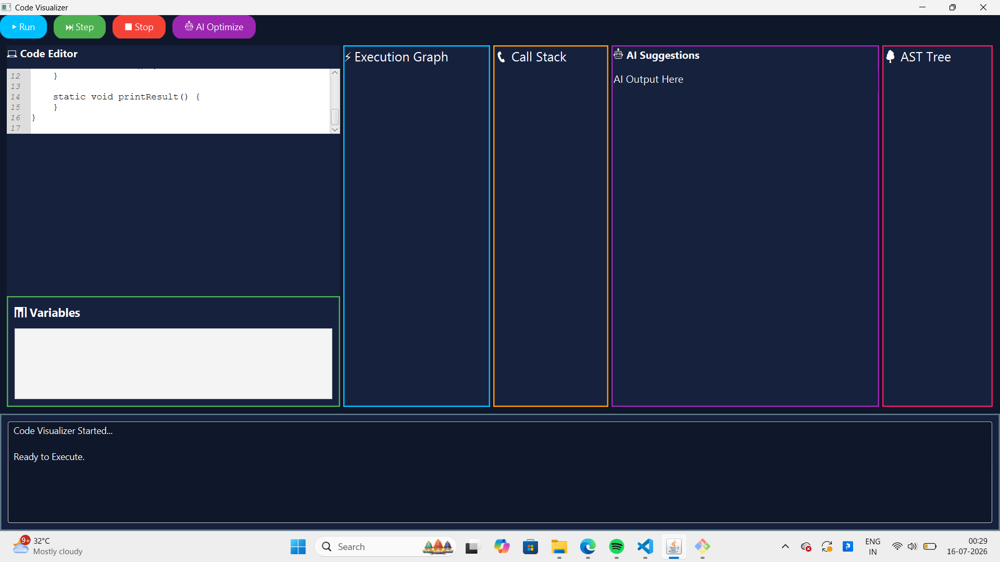
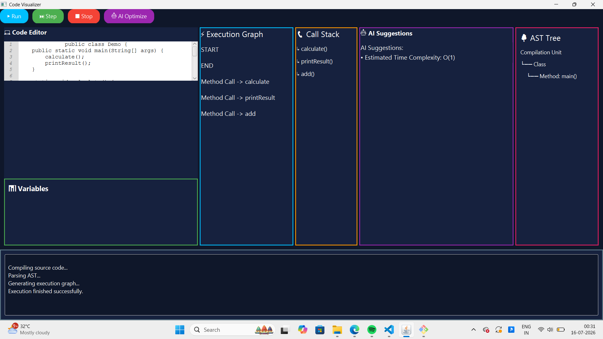
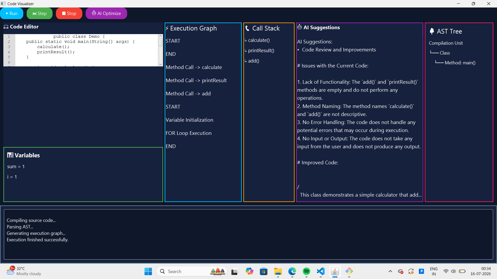
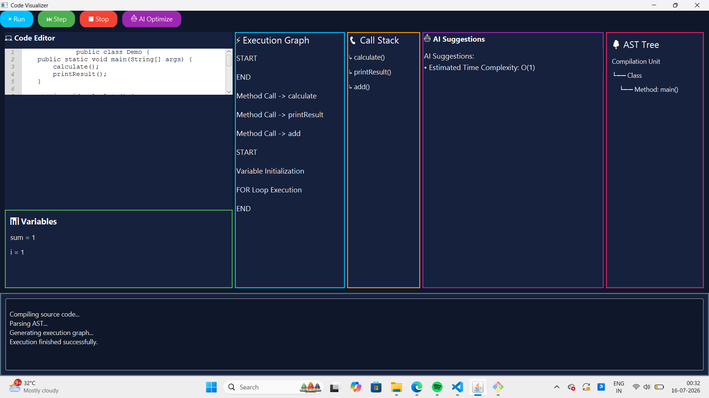

# AI Powered Code Visualizer
## Main UI

## Execution Graph

## AI Suggestions

## Step Execution

An AI-powered Java desktop application for visualizing code execution and performing static analysis.

## Features
- Code Editor
- Execution Graph Visualization
- Variable Tracking
- Call Stack Visualization
- AST Tree Generation
- AI Code Suggestions
- Time Complexity Estimation

## Tech Stack
- Java 17
- JavaFX
- Maven
- JavaParser
- Groq API

## Project Structure
src/
 ├── parser/
 ├── service/
 └── ui/

## Future Improvements
- CFG Visualization
- Memory Heap Visualization
- Multi-language Support
